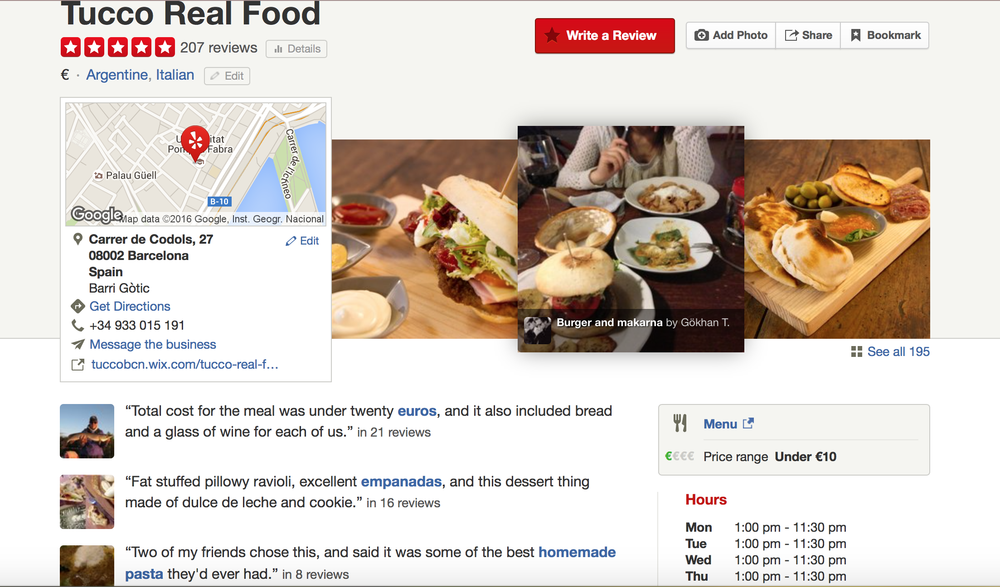

We decided to scrape data from [yelp.com](yelp.com). Yelp is a website where people can write reviews and recommendations and rate the restaurants of a city.  

For this project, we scraped the reviews of all the restaurants in Barcelona, which included:

* Text

* Score

* Information of the user: 
    + Number of friends
    + Number of reviews
    + Nationality 

* Details of the restaurant: 
    + Type of food 
    + Price category
 
And we stored each review in a *.json* file.  
\
\

*Figure 1. Yelp ScreenShot*

## 1. Instructions

First of all, import the follwing python modules:

- bs4
- urllib
- time
- random
- json
- os

In the web_crawler folder of our github account, you can find two files:

- *accepted_yelp_links_small*: small sample of links
- *web_scrapping-yelp.py*: script to scrape the data. 

The next step is to create two folders, one called Links and other called Rejected. Modify the file *web_scrapping-yelp.py*:

1. Line 173: write the directory of the file  *accepted_yelp_links_small*.
2. Line 181: write the directory of the folder Links.
3. Line 186: write the directory of the folder Rejected.

Now everything is ready! You can run the script *web_scrapping-yelp.py*. Once it finished, you will find in the folder Links, all the json files with the reviews. In the folder Rejected, you will find a text file with the URLs of the rejected links.

## 2. How it works?

Save all the URLs of the restaurants you want to scrape in a file. For each URL, do:

1. Get the html code. 
2. Each review has a link attributed. Get all the urls of the reviews of that restaurant.
3. Store the characteristics of the restaurant in variables: the type and the price category of the restaurant. 
4. For each review (or link found in step 2): get the html code of that page and store the data: text, score, user name, nacionality, number of friends and number of reviews. After each iteration, stop some seconds.  

Write a *.json* file for each of the reviews. If some of the previous steps fails, write the URL of the restaurant in a file called *rejected.txt*. 

Finally, after each iteration, stop a random amount of seconds.
  

## 3. Dealing with errors

In order to make our code robust, we exploited Python's exception handling. Our crawler iterates through a file of url links, tries to open the url and write the data to a *.json* file. If for whatever reason this fails, the rejected link is appended to a *rejected* file, and the iterative process continues. Exception handling allowed us to continue the iterative process without interruption, knowning that any links raising an error would be written to the *rejected* file.  

## 4. What features have you implemented specifially to tadhere to the robots.txt file of your target website?

The *robot.txt* file allowed us to grab the information we wanted, in fact, the website only disallowed the collection of business photos and urls, user bookmarks and friends, and other minor things.  We were not interested in this information, so this was not a problem. As mentioned above, our crawler iterates through a file of yelp urls. In order to avoid being blocked by the website, we introduce a random delay between $1$ and $5$ seconds after each iteration. On top of this, we add another random delay after the function has opened the url and collected the information. This random delay is between $1$ and $4$ seconds. We had no problems collected the data, and were able to completeely scrape yelp.com of restaurant reviews in Barcelona. 